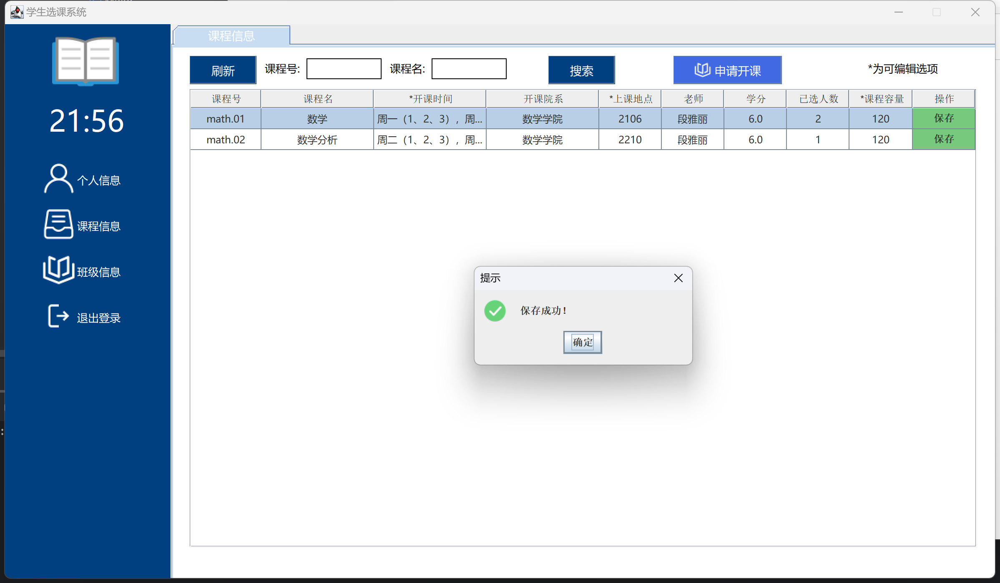

# student-course-selection

学生选课系统 scs - student-course-selection

java + jdbc + swing

## 以下是程序设计报告内容

**目录**

学生选课系统

摘要

第 一 章 绪 论

1.1 开发环境

1.2 本报告的主要内容

第二章 需求分析

2.1系统需求简介

2.1.1 系统目标

2.1.2 功能需求分析

2.1.3 性能需求分析

第三章 总体设计

3.1 设计概述

3.2 系统总体结构及功能模块划分

3.2.1 业务层

3.2.2 视图层

3.2.3 控制层

3.3 系统数据库概念结构设计

3.4 界面设计

3.5 安全保密设计

3.5.1 用户登录安全性

3.5.2 用户信息安全性

第四章 详细设计

4.1 系统主要功能模块简介

4.1.1项目结构

4.1.2 项目结构解析

第五章 代码类设计

5.1 登录界面代码设计

5.2 学生选课界面

5.3 学生退课界面

5.4 学生课表界面

5.5 授课信息管理

5.6 班级信息管理

5.7 管理员主界面

5.8 课程管理主页面

5.9 课程增添页面

5.10 课程编辑页面

5.11 学生管理主页面

5.12 学生增添页面

5.13 学生编辑页面

5.14 老师管理主页面

5.15 老师增添页面

5.16 老师编辑页面

第六章 课程设计心得

**学生选课系统**

# **摘要**

本文描述的是基于 Java Swing 的学生选课系统，主要编程思想有，java 封装继承多态, java 设计模式，还有 MYSQL 数据库 的增删改查功能的实现。
本篇报告介绍一个学生选课系统的从分析到设计最后到开发的全过程为，给出了学生选课系统的设计和技术实现的过程，特别在细节上分析功能和函数的实现思想。涉及到学生选课系统管理的基本功能在本报告中都有相应的描述。

## **_第 一 章_** **_绪 论_**

### **1.1** **_开发环境_**

**_数据库_**: **_Mysql8.0 ,_** 关系型数据库,MySQL 是一种关系型数据库管理系统，关系数据库将数据保存在不同的表中，而不是将所有数据放在一个大仓库内，这样就增加了速度并提高了灵活性。

**_开发工具_**: **_IDEA 2020_** , IDEA 全称 IntelliJ IDEA，是 java 编程语言开发的集成环境。

**_包管理: Maven 。_** Maven 项目对象模型(POM)，可以通过一小段描述信息来管理项目的构建，报告和[文档](https://baike.baidu.com/item/文档/1009768)的[项目管理工具](https://baike.baidu.com/item/项目管理工具/6854630)软件。

### **1.2** **_本报告的主要内容_**

本报告详细的介绍了学生信息管理系统的开发过程，主要涉及到的工作如下：系统的需求分析、系统的总体设计、系统的概念设计、系统各模块的详细设计、系统运行与测试。

## **_第二章_** **需求分析**

### **2.1** **_系统需求简介_**

#### 2.1.1 系统目标

（1） 根据 SQL 查询实现对账号，专业，班级，学生，教师，课程，选课等信息的查询

（2） 账号，专业，班级，学生，教师，课程，选课，等信息的增加、删除、修改

#### 2.1.2 功能需求分析

主要功能模块包括 学生管理课程选择和退选，老师管理课程和管理班级，管理员管理学生和老师和课程信息。

**_管理员:_**

（1） 登录

（2） 管理课程信息的增删改查

（3） 管理学生信息的增删改查

（4） 管理教师信息的增删改查

**_学生：_**

（1） 登录

（2） 查看选课公告，获知选课开始结束时间

（3） 查看可选课程信息

（4） 选课

（5） 退课

（6） 查看已选课程

（7） 查看课程表

**_教师：_**

（1）登录

（2）查看全校课程

（3）申请开课

（4）查看自己班级的信息

（5）查看班级学生名单

#### 2.1.3 性能需求分析

（1） 登录、用户界面需求：简洁、易懂、易用、友好的用户界面。

（2） 安全保密性需求：只有凭借用户名和密码登陆系统，才能进行信息的管理等。

## **第三章** **总体设计**

### **3.1** **_设计概述_**

根据需求把整个系统分化成不同的模块，每个模块完成一个特定的子功能。把这些模块结合起来组成一个整体。逐一实现各个功能；

### **3.2** **_系统总体结构及功能模块划分_**

系统总体结构，我将划分为三层： 业务层，视图层，控制层，也就是经典的 MVC 架构模式。其中，业务层分为 dao 层和 model 层。


#### **3.2.1** **_业务层_**

业务层也就是 MVC 架构模式中的 M - model 业务模型。业务层我将分为 2 个部分，第一个部分是 数据层 Dao 层，第二个部分是业务层。数据层的功能就是对数据的控制，增删改查，业务层就是对数据层的进一步封装作为实体类，如 student 类、teacher 类等，并且进行业务逻辑的处理。

#### **3.2.2** **_视图层_**

视图层也就是 MVC 架构模式中的 V- view 用户界面。 视图层将采用 Java Swing GUI 框架，进行视图层的设计。分为 4 个部分，第一个部分是 登录界面，第二个部分是 管理员首页，第三个部分是 学生首页。第四个部分是老师首页。登录界面将采用 Java Swing 组件进行设计，管理员首页和学生首页将采用 Java Swing 组件进行设计，并且进行视图层的代码分离。

#### **3.2.3** **_控制层_**

控制层也就是 MVC 架构模式中的 C - controller 控制器。 控制层通过逻辑判断，实现对视图层和业务层的控制。如学生选课时候，通过控制层判断选课可行性。

### **3.3** **_系统数据库概念结构设计_**

根据对数据项与数据结构的分析，设计出能够满足系统需求的各种实体，及它们之间的关系，为后面的逻辑结构设计打下基础。

（一）学生表


（二）教师表


（三）学生选课表


（四）课程表


### **3.4** **_界面设计_**


### **3.5** **_安全保密设计_**

#### 3.5.1 用户登录安全性

系统设计了登录界面，每个合法用户有用户名及一个密码，只有当用户输入正确的用户名及密码组合后才能够操作。

#### 3.5.2 用户信息安全性
用户信息仅在个人信息界面可见，其他界面都不会显式的出现个人信息内容，确保用户信息的安全性。

## **第四章** **详细设计**

### **4.1** **_系统主要功能模块简介_**

#### **4.1.1** **_项目结构_**


#### **4.1.2** **_项目结构解析_**

```


├── src
│   ├── main
│   │   ├── java
│   │   │   └── com.ustc.studentcourseselection
│   │   │       ├── controller                  控制层
│   │   │       │   ├── CourseManagementUtils   课程管理
│   │   │       │   ├── LoginUtils              登录逻辑
│   │   │       │   ├── StudentCourseutils      选课逻辑
│   │   │       │   ├── StudentManagementUtils  学生管理
│   │   │       │   ├── StudentScheduleUtils    课程表制作
│   │   │       │   ├── TeacherCourseUtils      老师管理课程
│   │   │       │   └── TeacherManagementUtils  教师管理
│   │   │       ├── dao                         业务层
│   │   │       │   ├── CourseDao              课程与数据库交互
│   │   │       │   ├── DBconnection           数据库连接
│   │   │       │   ├── StudentCourseDao       学生选课
│   │   │       │   ├── StudentDao             学生增删改查
│   │   │       │   ├── TeacherDao             老师增删改查
│   │   │       │   └── TeacherCourseDao       老师与课程交互
│   │   │       ├── model                      实体类
│   │   │       │   ├── Administrator          
│   │   │       │   ├── BaseObject              
│   │   │       │   ├── BaseUtils
│   │   │       │   ├── Course      
│   │   │       │   ├── Student               
│   │   │       │   └── Teacher
│   │   │       ├── view                        视图层
│   │   │       │   ├── mainmenu                主面板
│   │   │       │   │   ├── manager                 管理员面板
│   │   │       │   │   │   ├──panel
│   │   │       │   │   │   │  ├── CourseAddPanel   
│   │   │       │   │   │   │  ├── CourseAddPanel
│   │   │       │   │   │   │  ├── CourseEdictPanel
│   │   │       │   │   │   │  ├── CourseManagementPanel
│   │   │       │   │   │   │  ├── StudentAddPanel
│   │   │       │   │   │   │  ├── StudentEdictPanel
│   │   │       │   │   │   │  ├── StudentManagementPanel
│   │   │       │   │   │   │  ├── TeacherAddPanel
│   │   │       │   │   │   │  ├── TeacherEdictPanel
│   │   │       │   │   │   │  ├── TeacherManagementPanel
│   │   │       │   │   │   ├── AbstractManagerPanel
│   │   │       │   │   │   └── ManagerMenu
│   │   │       │   │   ├── student                   学生面板
│   │   │       │   │   │   ├──panel    
│   │   │       │   │   │   │   ├── ChooseCoursePanelAbstract
│   │   │       │   │   │   │   ├── CourseChosenPanelAbstract
│   │   │       │   │   │   │   ├── PersonalinfoPanel
│   │   │       │   │   │   │   ├── StudentSchedule
│   │   │       │   │   │   ├── AbstractStudentPanel
│   │   │       │   │   │   ├── AbstractStudentSchedule
│   │   │       │   │   │   └── StudentMenu
│   │   │       │   │   ├── teacher                     老师面板
│   │   │       │   │   │   ├── panel
│   │   │       │   │   │   │   ├── ClassInfoPanelAbstract
│   │   │       │   │   │   │   ├── CourseInfoPanelAbstract
│   │   │       │   │   │   │   ├── PersonalinfoPanel
│   │   │       │   │   │   │   ├── PopUpPanel
│   │   │       │   │   │   ├── AbstractTeacherPanel
│   │   │       │   │   │   ├── TeacherMenu
│   │   │       │   ├── Login                       登录界面
│   │   │       │   ├── MainMenu                    初始面板
│   │   │       │   └── Panel                       面板父类
│   │   ├── C
│   │   ├── resources                               资源目录
│   │   │   └── images
│   │   └── test
│   └── target
└── pom.xml
└── README.txt
```

## **第五章** **主要功能模块代码**

### **5.1** ***登录界面代码设计***

 

 


### **5.2** ***学生选课界面***
对选课逻辑的控制器
 
界面设计
 

### **5.3** ***学生退课界面***
退课逻辑控制器
 
界面设计
 

### **5.4** ***学生课表界面***

 
 


### **5.5** ***授课信息管理***

 

 
 

### **5.6** ***班级信息管理***

 

 
 ### **5.7** ***管理员主界面***


### **5.8** ***课程管理主页面***


### **5.9** ***课程增添页面***


### **5.10** ***课程编辑页面***


### **5.11** ***学生管理主页面***


### **5.12** ***学生增添页面***


### **5.13** ***学生编辑页面***


### **5.14** ***老师管理主页面***


### **5.15** ***老师增添页面***


### **5.16** ***老师编辑页面***


## 第六章 课程设计心得

本次的 java 课程设计，我们对 java 有了一个全新的认识，从 java 的封装继承多态中，学到了如何组织代码中的各个部分，从 java swing 中，学会了如何管理各种组件，以及组件之间的通讯，传值，调用，依赖，并严格遵守设计模式的 6 大原则:

1、单一职责原则，实现类要职责单一；

2、里氏替换原则，不要破坏继承体系；

3、依赖倒置原则，要面向接口编程；

4、接口隔离原则，在设计接口的时候要精简单一；

5、迪米特原则，要降低耦合；

6、开闭原则，要对扩展开放，对修改关闭。
